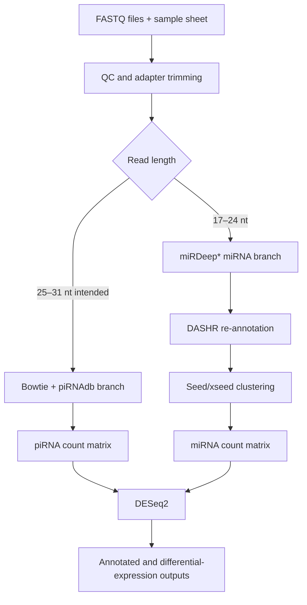
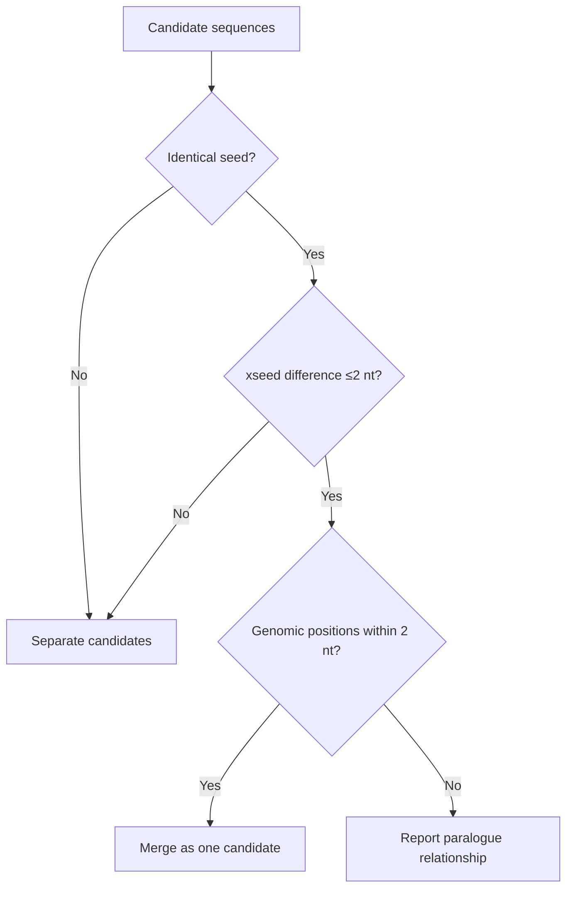

# miRPipe: Beginner and Advanced User Guide

> An illustrated guide to the purpose, workflow, use, interpretation, applications, benchmarking, and limitations of miRPipe.

[](https://doi.org/10.3389/fbinf.2022.842051)
[](https://github.com/vivekruhela/miRPipe)
[](https://github.com/vivekruhela/miRPipe/blob/main/LICENSE)

## Contents

- [Start here: what miRPipe does](#start-here-what-mirpipe-does)
- [Why small-RNA analysis is difficult](#why-small-rna-analysis-is-difficult)
- [The complete workflow](#the-complete-workflow)
- [Beginner quick start](#beginner-quick-start)
- [Inputs and outputs](#inputs-and-outputs)
- [Advanced-user guide](#advanced-user-guide)
- [Scientific significance](#scientific-significance)
- [Applications](#applications)
- [Published benchmark](#published-benchmark)
- [Comparison with other pipelines](#comparison-with-other-pipelines)
- [Limitations and responsible interpretation](#limitations-and-responsible-interpretation)
- [Troubleshooting](#troubleshooting)
- [Reproducibility checklist](#reproducibility-checklist)
- [Citation](#citation)

## Start here: what miRPipe does

miRPipe is an end-to-end workflow for analyzing **small-RNA sequencing** data. It was designed to identify and quantify:

- known microRNAs (miRNAs);
- candidate novel miRNAs;
- miRNA paralogues and other candidates that share functional seed sequences;
- reverse-complement sequences that could otherwise be misclassified; and
- previously annotated piwi-interacting RNAs (piRNAs).

For a cohort containing two biological groups, miRPipe can also build count matrices and run differential-expression analysis with DESeq2. The published implementation is delivered as an interactive Jupyter notebook inside a Docker image.

In plain language, miRPipe turns raw sequencing reads into annotated small-RNA counts and, when the study design permits, lists of small RNAs whose abundance differs between groups.


*Figure: miRPipe workflow supplied in the project repository. See the [peer-reviewed article](https://doi.org/10.3389/fbinf.2022.842051) for the formal method description.*

### Who should use this guide?

| Reader | Recommended sections |
|---|---|
| First-time small-RNA analyst | Start here, complete workflow, beginner quick start, inputs and outputs, troubleshooting |
| Bioinformatician | Advanced-user guide, limitations, comparison, reproducibility checklist |
| Experimental biologist | Start here, scientific significance, applications, outputs |
| Reviewer or methods developer | Published benchmark, limitations, comparison, reproducibility checklist |

## Why small-RNA analysis is difficult

Small RNAs are short, abundant, and often highly similar. A few nucleotides can determine whether two reads represent the same molecule, an isomiR, a paralogue, a sequencing artifact, or a different RNA class. Reads may also map to more than one genomic locus.

The following concepts are central to miRPipe:

| Term | Beginner explanation | Why it matters |
|---|---|---|
| miRNA | A short regulatory RNA, commonly around 17–24 nucleotides in this workflow | Its sequence and abundance can reflect gene-regulatory activity |
| piRNA | A class of small RNA commonly analyzed at longer lengths than miRNAs | It requires different filtering, mapping, and annotation rules |
| Seed region | A short part of a mature miRNA that contributes strongly to target recognition | Identical seeds may imply related regulatory behavior |
| xseed region | The portion outside the defined seed segment in the miRPipe method | It helps distinguish otherwise similar candidates |
| Paralogues | Related miRNAs that may share a seed sequence but originate from different loci | Collapsing or separating them changes interpretation and counts |
| Reverse complement | The complementary sequence written in the opposite orientation | Some aligners can map it but fail to assign the expected known-miRNA label |
| Ground truth | The known identity of each simulated read | It allows true positives, false positives, and false negatives to be measured |

miRPipe addresses these issues by combining alignment, database searches, sequence clustering, genomic-position checks, count aggregation, and statistical analysis.

## The complete workflow



### Stage-by-stage explanation

| Stage | What happens | Main component | Main output | Important check |
|---|---|---|---|---|
| 1. Input | Raw reads and sample metadata are collected | Jupyter/Python | Valid input set | Sample names and filenames must match exactly |
| 2. Initial QC | Per-sample and combined quality reports are produced | FastQC, MultiQC | QC reports | Confirm adapter sequence, read quality, and length distribution |
| 3. Adapter trimming | Library adapters are removed | Trim Galore | Trimmed FASTQ files | A wrong adapter can destroy signal or retain contamination |
| 4. Length and quality split | Reads are assigned to miRNA, piRNA, or rejected-length groups | BBDuk; FASTX quality filter | Length-specific FASTQ files | The paper and current script differ at the 24-nt boundary; see the advanced notes |
| 5A. miRNA alignment | Reads are aligned and classified as known or candidate novel miRNAs | miRDeep* over Bowtie | Per-sample miRNA results | Reference build and miRBase version must agree |
| 5B. piRNA alignment | Quality-filtered reads are mapped to the human genome and annotated | Bowtie, SAMtools, BEDTools, piRNAdb | Per-sample piRNA counts | The supplied branch uses exact mapping and disables reverse-complement alignment |
| 6. Count aggregation | Results from all samples are merged | Python/pandas | Cohort-wide raw counts | Confirm that each count column belongs to the correct sample |
| 7. Re-annotation | Candidate novel sequences are checked against DASHR, including reverse complements | DASHR search | Corrected known/novel labels | This browser-driven step is sensitive to external website and browser changes |
| 8. Seed-based clustering | Candidates are compared by seed, xseed sequence, and genomic location | CD-HIT plus custom Python logic | Unique candidates and paralogue groups | Review merged counts and locus assignments before biological interpretation |
| 9. Differential expression | Counts are normalized and groups are compared | DESeq2 | Statistics and significant-feature lists | The supplied script expects `treated` and `untreated` and models `~ condition` only |
| 10. Naming and export | Putative novel candidates are checked against Rfam and exported | Infernal/Rfam plus Python | Final annotated tables | Novel names ending in `*` are putative labels, not official miRBase registrations |

## Beginner quick start

### 1. Confirm that your experiment is appropriate

The published implementation is most directly suited to **human, single-end small-RNA FASTQ data**. For differential expression, prepare biological replicates in two groups. Do not treat technical replicates as independent biological samples.

Before running the pipeline, record:

- library-preparation kit and adapter sequence;
- sequencing orientation and quality encoding;
- reference genome build (`hg19` or `hg38`);
- miRNA annotation version;
- biological condition for each sample; and
- any known batch, sex, age, or clinical covariates.

The supplied DESeq2 script does not model those additional covariates. If they matter, export the count matrix and run a customized DESeq2 design outside the notebook.

### 2. Prepare the data directory

Place the FASTQ files and `sample_list.csv` in one directory. A minimal sample sheet is:

```csv
sample,file,condition
Sample_A,Sample_A.fastq.gz,treated
Sample_B,Sample_B.fastq.gz,treated
Sample_C,Sample_C.fastq.gz,untreated
Sample_D,Sample_D.fastq.gz,untreated
```

For the current notebook and R script:

- use the exact column names shown above;
- keep sample IDs unique;
- use the exact group values `treated` and `untreated`;
- verify that every listed file exists; and
- sort sample rows alphanumerically, because the published implementation relies on the sample order matching the final count-matrix columns.

Recommended layout:

```text
mirpipe-run/
└── data/
    ├── sample_list.csv
    ├── Sample_A.fastq.gz
    ├── Sample_B.fastq.gz
    ├── Sample_C.fastq.gz
    └── Sample_D.fastq.gz
```

### 3. Pull and run the Docker image

```bash
docker pull docker.io/vivekruhela/mirpipe

docker run --rm \
  -p 127.0.0.1:8880:8888 \
  -e PASSWORD='replace-with-a-strong-local-password' \
  -e USE_HTTP=1 \
  -v "$(pwd)/data:/miRPipe/data" \
  docker.io/vivekruhela/mirpipe
```

Open [http://localhost:8880/mirpipe](http://localhost:8880/mirpipe) and enter the password chosen in the command. Open the repository's actual pipeline notebook, **`mirpipe_pipeline.ipynb`**.

The `127.0.0.1` binding keeps the unencrypted Jupyter service local to the computer. On a remote Linux server, use an SSH tunnel rather than exposing port 8880 publicly:

```bash
ssh -L 8880:127.0.0.1:8880 username@server.example.edu
```

Then open the same localhost address on your own computer.

> Security note: never reuse an institutional, GitHub, Docker Hub, or email password as the notebook password. Do not expose this HTTP notebook directly to the internet.

### 4. Run the notebook carefully

Run one section at a time and inspect its output before continuing.

1. Confirm the printed home, data, tools, and reference directories.
2. Review FastQC/MultiQC reports.
3. Select the correct adapter option.
4. Select a compatible genome-build and miRBase combination.
5. Run the miRNA and/or piRNA branch.
6. Check the number of known and candidate novel features.
7. Review re-annotation and seed-clustering results.
8. Confirm the count-matrix column order against `sample_list.csv`.
9. Run DESeq2 only after those checks pass.
10. Copy final results and all run metadata to a permanent project directory.

## Inputs and outputs

### Required inputs

| Input | Required? | Description |
|---|---:|---|
| FASTQ/FASTQ.GZ | Yes | Raw small-RNA sequencing reads |
| `sample_list.csv` | Required for cohort/DE analysis | Sample, filename, and condition mapping |
| Adapter sequence | Yes, explicit or default | Must match the library-preparation protocol |
| Reference genome | Yes | Human `hg19` or `hg38` in the published workflow |
| miRNA/piRNA annotations | Yes | miRBase and piRNAdb resources matching the chosen build |

### Five final output files documented in the repository

| File | Meaning | Typical downstream use |
|---|---|---|
| `final_diff_exp_miRNAs.csv` | Significant known/novel miRNAs with effect and annotation fields | Candidate prioritization and reporting |
| `diff_exp_miRNAs_expression_counts.csv` | Counts for significant miRNAs | Heatmaps and sample-level inspection |
| `miRNA_expression_counts.csv` | Cohort miRNA raw-count matrix | Customized DESeq2/edgeR analysis |
| `piRNA_raw_counts.csv` | Cohort piRNA raw-count matrix | Customized piRNA analysis |
| `significantly_DE_piRNA.csv` | Significant piRNA identifiers | Candidate follow-up |

Also retain the QC reports, complete DESeq2 result tables, normalized counts, software versions, logs, and intermediate annotation tables. A significant-only table is insufficient for reproducible review.


## Advanced-user guide

### Read-length boundary

The paper describes 17–24 nt reads for miRNA analysis and 25–31 nt reads for piRNA analysis. The current `scripts/fastq_split.sh`, however, sets `minlength=24` and `maxlength=31` for the piRNA branch. That creates a 24-nt overlap between the two branches.

Before a new study, decide whether to reproduce the published intention or the repository implementation. Record the decision and benchmark it because a one-nucleotide boundary can change RNA-class assignment.

### piRNA mapping behavior

The supplied piRNA script uses Bowtie with exact matching (`-v 0`), disables reverse-complement alignment (`--norc`), and quantifies overlap with piRNAdb annotations. These choices are stringent. They can reduce false-positive mappings but can also miss legitimate reads containing sequencing errors, biological variation, or opposite-strand mappings.

For a new production study, document:

- unique versus multi-mapping policy;
- allowed mismatches;
- strand rule;
- annotation database and release;
- genome build; and
- how overlapping annotations are counted.

### miRNA alignment and re-annotation

miRDeep* performs the initial known/novel miRNA classification. miRPipe then checks candidate novel sequences against DASHR. If a sequence or its reverse complement matches a known miRNA at a compatible locus, its label and counts can be reassigned.

This is one of the method's distinctive ideas, but the notebook automates a public website through an older Firefox/Splinter/geckodriver setup. For stable modern operation, replace browser automation with a versioned, locally downloadable annotation resource or a documented API if licensing and availability permit.

### Seed/xseed clustering logic

The published method uses the following concepts:

1. Group sequences with identical seed regions.
2. Compare the sequence outside the seed.
3. Treat candidates with identical seed, no more than two xseed changes, and genomic positions within two nucleotides as one novel miRNA; merge their counts.
4. Treat identical-seed candidates at different loci as paralogue candidates.
5. Associate a novel candidate with a known family when it shares the known miRNA seed but maps to a different locus.



These operational rules are useful for reproducibility, but “same seed” does not by itself prove identical biological function. Target context, arm selection, expression, localization, and experimental validation still matter.

### Differential-expression model

The supplied `scripts/norm_diff_exp.R` uses:

```r
design = ~ condition
contrast = c("condition", "treated", "untreated")
```

It applies the Benjamini–Hochberg procedure and selects features with adjusted p-value ≤ 0.05. The script does not include batch, age, sex, paired design, repeated measures, surrogate variables, or fold-change shrinkage.

For complex studies, use the exported raw-count matrix with an appropriate design, for example:

```r
design = ~ batch + sex + age + condition
```

The exact model must follow the experimental design; the example is not universally appropriate. Also consider low-count prefiltering, independent filtering, effect-size thresholds, unwanted-variation diagnostics, and shrinkage of log2 fold changes.

### Scaling to cohorts and HPC

miRPipe batches samples and runs miRDeep* work in Python threads, while the piRNA branch runs concurrently. This can accelerate multi-sample processing, but resource control is implemented inside a notebook rather than through a scheduler-aware workflow engine.

For an HPC deployment:

- run one container image identified by immutable digest;
- allocate memory per concurrent miRDeep* task;
- avoid oversubscribing CPUs inside a SLURM allocation;
- separate temporary and permanent storage;
- retain per-sample logs and exit codes;
- use a manifest rather than depending on directory glob order; and
- consider refactoring stages into Nextflow, Snakemake, or CWL while preserving miRPipe's re-annotation and clustering logic.

### Minimum QC report for a publication

Report at least:

- samples received, excluded, and analyzed;
- reads before and after adapter/quality filtering;
- read-length distribution;
- fraction assigned to miRNA, piRNA, other small RNA, and unmapped;
- mapping-rate and multi-mapping distribution;
- known versus candidate novel counts;
- number of candidates re-annotated through DASHR;
- number of clusters merged and paralogue groups reported;
- PCA/sample-distance plots from final counts;
- DE model, contrasts, covariates, multiple-testing rule, and effect-size rule; and
- exact software, container, reference, and database versions.

## Scientific significance

### Methodological significance

miRPipe combines tasks that were often handled separately: known and novel miRNA discovery, piRNA quantification, reverse-complement rescue, seed-based candidate reconciliation, cohort count-matrix construction, and differential expression. Its companion simulator, miRSim, provides ground truth for measuring false positives and false negatives.

### Biological significance

Small RNAs regulate gene expression and may reflect disease mechanisms, cell states, or treatment responses. Reliable classification matters because an incorrect label or duplicated count can redirect downstream target prediction, enrichment, biomarker selection, and experimental validation.

### Reproducibility significance

Containerization and a notebook lower the installation barrier and make the intended analysis visible. The design was especially valuable for users who needed an integrated workflow in 2022. A modern refresh should retain that accessibility while adding immutable images, command-line configuration, automated tests, and scheduler-aware execution.

## Applications

miRPipe can support:

- exploratory small-RNA profiling in cancer and other diseases;
- identification of known and candidate novel miRNAs;
- cohort-level differential-expression analysis;
- piRNA quantification from compatible small-RNA libraries;
- paralogue-aware review of miRNA candidates;
- re-evaluation of candidates affected by reverse-complement labeling;
- benchmarking of small-RNA pipelines using miRSim ground truth;
- method development and sensitivity analysis; and
- non-human analyses after validated replacement of the genome and annotation resources.

It should **not** be presented as a clinical diagnostic system without independent analytical validation, biological validation, version-controlled references, quality-management procedures, and appropriate regulatory review.

## Published benchmark

The 2022 article compared miRPipe with seven pipelines using miRSim synthetic data at 50,000, 100,000, and 1,000,000 reads. The following values reproduce the averages reported in Table 2 of the paper.

| Pipeline | Known miRNA accuracy | Known miRNA F1 | Novel miRNA accuracy | Novel miRNA F1 | Known piRNA accuracy | Known piRNA F1 |
|---|---:|---:|---:|---:|---:|---:|
| miRDeep2 | 94.74% | 85.66% | 97.33% | 85.27% | — | — |
| miRDeep* | 95.67% | 88.06% | 99.04% | 95.47% | — | — |
| mirPRo | 78.73% | 1.45% | 93.04% | 60.93% | — | — |
| mirnovo | 87.59% | 60.61% | 91.78% | 41.95% | — | — |
| miRge2.0 | 82.56% | 25.90% | 0.00% | 0.00% | — | — |
| sRNAbench | 89.18% | 67.93% | 0.00% | 0.00% | 74.25% | 4.34% |
| MiR&moRe2 | 91.07% | 74.05% | 92.52% | 46.76% | — | — |
| **miRPipe** | **96.58%** | **89.95%** | **99.55%** | **97.55%** | **98.91%** | **94.35%** |

The reported overall average was approximately 95.22% accuracy and 94.17% F1 across RNA types and depths. The abstract reports 95.23% for accuracy, a small rounding/reporting difference.

<table>
  <tr>
    <th>50K reads</th>
    <th>0.1M reads</th>
    <th>1M reads</th>
  </tr>
  <tr>
    <td></td>
    <td></td>
    <td></td>
  </tr>
</table>


## Comparison with other pipelines

The table below is a **capability-oriented current-use guide**, not a new head-to-head performance benchmark.

| Tool/workflow | Strong use case | Relevant capabilities | Main trade-off relative to miRPipe |
|---|---|---|---|
| **miRPipe** | Reproducing the published method; joint miRNA/piRNA analysis with seed/paralogue logic | Known/novel miRNA, annotated piRNA, reverse-complement review, DESeq2, Docker/Jupyter | Older dependencies and brittle external searches; limited automation/testing in the current repository |
| **miRDeep2** | Classic known and novel miRNA discovery | Mature/precursor evidence, novel-miRNA scoring, expression profiling | Does not provide miRPipe's integrated piRNA, reverse-complement, seed-clustering, and cohort-DE wrapper |
| **miRge3.0** | Feature-rich miRNA and tRF profiling | miRNA, isomiR, novel miRNA, tRF, UMI processing, A-to-I editing, CLI/GUI | Different biological scope; not a direct replacement for miRPipe's dedicated piRNA branch or clustering rules |
| **sRNAbench / sRNAtoolbox** | Broad small-RNA profiling and accessible web/Docker workflows | miRNA and other sncRNAs, differential expression, unmapped-read analysis, target analysis; model and non-model organisms | Uses its own annotation and prediction framework; does not reproduce miRPipe's exact candidate reconciliation |
| **nf-core/smrnaseq** | Reproducible production analysis on HPC/cloud | Nextflow, containers per process, automated tests, FastQC/MultiQC, miRTrace, mirtop/isomiR, miRDeep2, edgeR | Stronger workflow engineering, but no equivalent dedicated miRPipe seed/paralogue and piRNAdb branch |

### Practical selection guide

- Choose **miRPipe** when the scientific question specifically needs the published reverse-complement, seed/xseed, paralogue, and joint miRNA/piRNA logic.
- Choose **nf-core/smrnaseq** when production-grade portability, automated testing, provenance, HPC execution, and broad QC are the primary needs.
- Choose **miRge3.0** when UMI, isomiR, tRF, or A-to-I editing analysis is central.
- Choose **sRNAtoolbox/sRNAbench** for broad small-RNA profiling, web access, Docker deployment, or non-model organisms.
- Choose **miRDeep2** for a focused and widely recognized known/novel miRNA discovery workflow.

For a new methods paper, benchmark multiple tools under the same inputs, reference versions, compute limits, parameter-tuning policy, and independent ground truth.

## Troubleshooting

| Symptom | Likely cause | What to check |
|---|---|---|
| Jupyter page does not open | Container stopped, port conflict, or incorrect URL | Run `docker ps`; confirm port `8880`; use `/mirpipe` in the URL |
| FASTQ files are not visible | Incorrect bind-mount source or destination | Mount the host data directory to `/miRPipe/data` |
| Adapter-trimming results are empty or poor | Wrong adapter or incompatible filename handling | Confirm kit adapter; inspect Trim Galore log; test one sample manually |
| No miRNAs are detected | Wrong build/database, poor small-RNA library, or overly strict filtering | Check read lengths, mapping rate, reference selection, and FastQC/MultiQC |
| Unexpected overlap between RNA classes | 24-nt boundary discrepancy | Inspect `scripts/fastq_split.sh`; document and test the chosen boundary |
| DASHR step fails | Website, Firefox, Splinter, or geckodriver incompatibility | Preserve candidates; perform a documented local re-annotation alternative rather than silently skipping the step |
| DESeq2 contrast error | Group names differ from hard-coded values | Use exactly `treated` and `untreated`, or edit the R contrast deliberately |
| Sample labels do not match count columns | Ordering dependency or inconsistent filenames | Sort and compare `sample_list.csv` with the final matrix before DESeq2 |
| No significant features | Low power, weak effect, high dispersion, or multiple-testing burden | Inspect all results, sample distances, counts, effect sizes, and study design; do not relax FDR only to obtain hits |
| Non-human analysis fails | Human-specific reference paths and annotations | Build and validate species-specific indices and annotation resources throughout all branches |

## Citation

If miRPipe is used, cite:

> Ruhela V, Gupta A, Sriram K, Ahuja G, Kaur G, Gupta R. A Unified Computational Framework for a Robust, Reliable, and Reproducible Identification of Novel miRNAs From the RNA Sequencing Data. *Frontiers in Bioinformatics*. 2022;2:842051. [https://doi.org/10.3389/fbinf.2022.842051](https://doi.org/10.3389/fbinf.2022.842051)

BibTeX:

```bibtex
@article{ruhela2022mirpipe,
  title   = {A Unified Computational Framework for a Robust, Reliable, and Reproducible Identification of Novel miRNAs From the RNA Sequencing Data},
  author  = {Ruhela, Vivek and Gupta, Anubha and Sriram, K. and Ahuja, Gaurav and Kaur, Gurvinder and Gupta, Ritu},
  journal = {Frontiers in Bioinformatics},
  volume  = {2},
  pages   = {842051},
  year    = {2022},
  doi     = {10.3389/fbinf.2022.842051}
}
```

## Project and comparison resources

- [miRPipe source repository](https://github.com/vivekruhela/miRPipe)
- [miRPipe article](https://www.frontiersin.org/journals/bioinformatics/articles/10.3389/fbinf.2022.842051/full)
- [miRSim source repository](https://github.com/vivekruhela/miRSim)
- [miRDeep2 documentation](https://www.mdc-berlin.de/content/mirdeep2-documentation)
- [miRge3.0 source and documentation](https://github.com/mhalushka/miRge3.0)
- [sRNAtoolbox source and documentation](https://github.com/bioinfoUGR/sRNAtoolbox)
- [nf-core/smrnaseq](https://nf-co.re/smrnaseq/2.4.1/)
