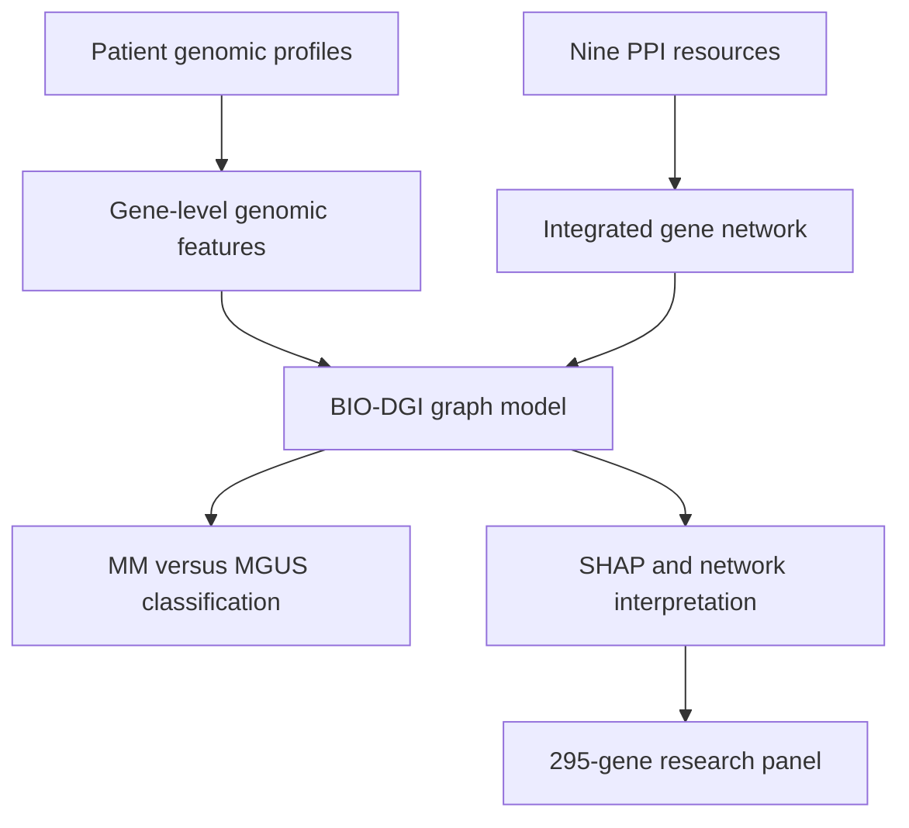
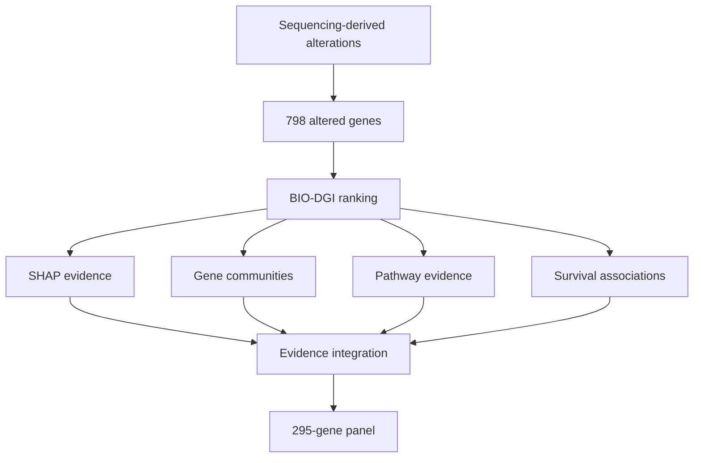

# From Genomic Complexity to a 295-Gene Panel

## How BIO-DGI connects genomic variation, gene networks, and explainable AI in multiple myeloma

Multiple myeloma (MM) is a cancer of antibody-producing plasma cells. It is usually preceded by a clinically silent precursor condition called **monoclonal gammopathy of undetermined significance (MGUS)**. Although MGUS is common and only a subset of cases progresses to active disease, the molecular events that distinguish stable precursor disease from malignant transformation remain difficult to resolve.

Our study, **“A comprehensive targeted panel of 295 genes: Unveiling key disease initiating and transformative biomarkers in multiple myeloma,”** addresses this problem with a biologically informed artificial-intelligence framework called **BIO-DGI**—Bio-Inspired Graph Network Learning-based Gene–Gene Interaction. The work was published in *Computers in Biology and Medicine* in 2025 ([PubMed](https://pubmed.ncbi.nlm.nih.gov/40617081/); [DOI](https://doi.org/10.1016/j.compbiomed.2025.110619)). The accompanying research code and analysis notebooks are available in the [BIO-DGI GitHub repository](https://github.com/vivekruhela/BIO-DGI).

The central idea is simple: a gene should not be studied only as an isolated column in a data table. Genes operate in pathways and molecular networks. BIO-DGI therefore combines patient-level genomic features with prior knowledge of protein–protein interactions, allowing the model to learn not only **which genes matter**, but also **which biological relationships may help distinguish MGUS from MM**.


*Figure 1. Overview of the BIO-DGI workflow. Source: [BIO-DGI repository](https://github.com/vivekruhela/BIO-DGI/blob/main/infographic_abstract.jpg).*

> **In one sentence:** BIO-DGI treats genes as an interacting biological system, uses explainable graph learning to identify signals separating MGUS from MM, and translates those signals into a focused 295-gene research panel.

---

## Background: Why this problem matters

MGUS and MM share many genomic alterations. This makes the transition between the two states more subtle than a simple “mutation present versus mutation absent” comparison. Several questions arise:

1. Which alterations are already present in the precursor state?
2. Which genes become selectively altered as malignant disease emerges?
3. Do combinations of interacting genes contain more information than single genes considered independently?
4. Can a model remain accurate while also providing biologically interpretable evidence?
5. Can the resulting discoveries be compressed into a panel that is more practical to investigate than whole-exome or whole-genome sequencing?

These questions motivated two useful biological concepts in the paper:

- **Disease-initiating genes:** genes with alterations detectable in both MGUS and MM, making them candidates for early events in disease development.
- **Disease-transformative genes:** genes whose alterations are associated more specifically with the malignant MM state and may help characterize the transition from precursor disease.

These labels describe evidence from the analyzed cohorts. They do not, by themselves, prove that an alteration causes disease or that it can predict progression in an individual patient.

---

## The challenge of turning sequencing data into biological insight

Whole-exome and whole-genome studies produce high-dimensional data. A single patient can carry many types of genomic change, including:

- single-nucleotide variants (SNVs),
- small insertions and deletions,
- copy-number variants (CNVs),
- structural variants (SVs), and
- loss-of-function events.

Traditional machine-learning methods often represent every gene as an independent feature. This is convenient, but biologically incomplete. For example, a modest alteration in one gene may become important when several of its interaction partners are also disrupted. Conversely, a frequently altered gene may contribute little to the specific distinction being modeled.

BIO-DGI introduces biological structure before learning begins. Genes are represented as **nodes**, known or predicted protein interactions as **edges**, and genomic measurements as **node features**. The model can then propagate information through the graph and learn which relationships are useful for classifying MM and MGUS profiles.



---

## Study data at a glance

The study analyzed genomic profiles from **1,154 MM samples** and **61 MGUS samples** collected across American, European, and Indian populations. Starting from sequencing-derived alterations, the workflow identified **798 significantly altered genes** for graph modeling.

For each sample, the repository’s graphical abstract describes **26 genomic features per gene**. These feature vectors summarize multiple aspects of the gene’s alteration profile rather than relying on a single mutation count.

| Component | Role in the study |
|---|---|
| 1,154 MM profiles | Represent the malignant disease state |
| 61 MGUS profiles | Represent the precursor state |
| 798 altered genes | Initial graph nodes considered by BIO-DGI |
| 26 features per gene | Patient-specific genomic description of each node |
| Nine PPI resources | Prior knowledge used to construct gene–gene relationships |
| 295 selected genes | Final targeted research panel |
| 9,417 coding regions | Coding targets covered by the reported panel |
| 2.630 Mb | Reported total panel footprint |

The nine protein-interaction resources integrated in the workflow were **BioGRID, BioPlex, FunCoup, HIPPIE, IAS, HumanNet, ProteomeHD, Reactome, and STRING**. Combining several resources reduces dependence on a single database, although it can also introduce duplicated, predicted, context-independent, or unevenly supported interactions.

---

## BIO-DGI for beginners: a social-network analogy

Imagine trying to understand an organization by looking only at individual résumés. You might learn who has certain skills, but not who collaborates with whom, which teams exchange information, or which relationships become important during a crisis.

BIO-DGI adds that missing organizational map:

- A **gene** is a person.
- A **protein–protein interaction** is a known working relationship.
- A gene’s **genomic features** are that person’s current state or activity profile.
- **Attention weights** estimate which relationships are most informative for the current task.
- A **graph convolution** allows each gene to incorporate information from its neighbors.
- The final classifier estimates whether the complete pattern resembles MGUS or MM.

This analogy also explains why interpretation matters. A useful model should not merely output “MM.” It should help us inspect which genes, genomic features, and neighborhoods contributed to that result.

---

## BIO-DGI for advanced readers

For a given patient, the genomic input can be viewed as a feature matrix \(X\), where rows correspond to genes and columns correspond to genomic measurements. The prior interaction network is represented by an adjacency matrix \(A\).

BIO-DGI applies a multi-head attention mechanism to learn context-relevant weights for gene–gene relationships. Conceptually, the learned adjacency can be written as:

$$
\tilde{A} = \mathrm{Attention}(A,X)
$$

A graph-convolutional layer then aggregates each gene’s features with information from its neighbors:

$$
H^{(l+1)} = \sigma\!\left(\hat{D}^{-1/2}\hat{A}\hat{D}^{-1/2}H^{(l)}W^{(l)}\right),
$$

where \(\hat{A}\) includes the learned or updated graph structure, \(\hat{D}\) is its degree matrix, \(H^{(l)}\) is the representation at layer \(l\), \(W^{(l)}\) contains learned parameters, and \(\sigma\) is a nonlinear activation.

The graph representation passes through a fully connected layer and softmax output for supervised MM-versus-MGUS classification. The essential design choice is that the model does not use a static PPI graph as mere decoration: attention is used to modify the relative importance of edges before graph aggregation.

### Why multi-head attention?

Different attention heads can learn different relationship patterns. One head might prioritize interactions involving mutation burden, while another could emphasize copy-number or loss-of-function context. The heads do not automatically correspond to clean biological mechanisms, but they increase the capacity to represent more than one interaction pattern.

### Why graph convolution?

Graph convolution encodes the assumption that a gene’s relevance can depend partly on its neighborhood. This is well suited to signaling and protein-interaction systems, where coordinated perturbation may be more informative than isolated events.

### Why a supervised endpoint?

The MM/MGUS label provides a task-specific learning signal. It directs the network toward patterns that discriminate the malignant and precursor cohorts, after which post-hoc interpretation is used to investigate the model’s biological reasoning.

---

## From prediction to explanation

High classification performance alone is not sufficient for biomarker discovery. A model can exploit technical artifacts, cohort imbalance, or correlates with no mechanistic significance. The study therefore used several complementary interpretation steps.

### 1. SHAP-based feature interpretation

SHAP assigns a contribution score to a feature relative to a model prediction. In this setting, it helps answer questions such as:

- Which genes contribute most strongly to MM-versus-MGUS discrimination?
- Which genomic feature types drive the importance of a gene?
- Are important signals consistent across samples and model folds?

SHAP describes the fitted model; it does not establish causal biology. A high SHAP value means that a feature influenced the model’s prediction under the learned representation.

### 2. Gene-community analysis

Biological networks contain communities—groups of densely connected genes. Community analysis helps place a highly ranked gene in a functional neighborhood and can expose influential genes that connect multiple modules.

This matters because cancer phenotypes often arise from pathway disruption rather than a single lesion. A gene with moderate individual importance may still be valuable if it links a strongly altered community.

### 3. Pathway enrichment

Pathway analysis tests whether the prioritized genes are over-represented in known biological processes. The paper reports that the selected genes strongly recover MM-related pathways, providing an orthogonal biological check on the model-derived ranking.

Enrichment should be interpreted carefully: it depends on the gene universe, pathway-database version, overlapping annotations, and multiple-testing procedure.

### 4. Survival analysis

The clinical relevance of the selected genes was examined using a two-fold univariate survival-analysis strategy. Association with survival strengthens the argument that the panel contains disease-relevant information, but it is not equivalent to prospective clinical validation or proof that the panel improves patient management.

### 5. Comparison with prior panels

The 295-gene design was evaluated against previously published MM panels for its ability to cover genomic and transformative events. The reported design contains 9,417 coding regions spanning 2.630 Mb.

Comparisons between panels require context. A larger number of covered genes is not automatically better: sequencing depth, bait design, translocation coverage, copy-number performance, sample quality, and intended clinical use all influence utility.

---

## How the 295-gene panel emerges

The panel is best understood as the final product of several evidence filters rather than a list generated by one importance score.



This layered approach is important. It combines:

- predictive evidence from MM/MGUS discrimination,
- model-explanation evidence,
- prior biological-network context,
- pathway-level coherence,
- disease-stage interpretation, and
- outcome association.

The result is a hypothesis-driven targeted panel intended to capture both early and transformation-associated biology.

---

## What makes this work significant?

### It moves from isolated markers to interacting systems

Many biomarker pipelines rank genes independently. BIO-DGI explicitly incorporates relationships among genes and learns which connections matter for the classification task.

### It integrates multiple variant classes

The framework summarizes more than one genomic event type. This is important in MM, where SNVs, CNVs, structural changes, and loss-of-function events can jointly shape disease behavior.

### It connects model performance with interpretability

The paper reports that BIO-DGI outperformed baseline machine-learning and deep-learning approaches on quantitative metrics and recovered the largest number of MM-relevant genes in its post-hoc comparison. More importantly, the analysis attempts to connect model decisions to genes, genomic features, communities, pathways, and survival.

### It produces a focused experimental object

A 2.630 Mb targeted design is substantially more focused than an exome or genome. In principle, a focused panel can support deeper sequencing, lower per-sample sequencing cost, and repeated evaluation of selected regions. Actual performance and cost depend on assay design and laboratory validation.

### It introduces a disease-stage perspective

Distinguishing alterations shared by MGUS and MM from those enriched in malignant disease encourages a temporal interpretation of myeloma genomics. This is a useful framework for studying initiation and transformation, even though cross-sectional cohorts cannot fully reconstruct the evolution of an individual patient.

---

## Potential applications

The panel and BIO-DGI framework can support several **research** applications:

1. **MGUS-to-MM progression studies**  
   Test whether panel alterations are associated with longitudinal progression in independent precursor cohorts.

2. **Biomarker prioritization**  
   Identify genes and network communities for functional follow-up using cell lines, organoids, CRISPR perturbation, or other experimental systems.

3. **Targeted cohort profiling**  
   Generate deeper coverage of selected regions in larger research cohorts when WES or WGS is impractical.

4. **Pathway-focused studies**  
   Investigate whether groups of panel genes converge on recurrent myeloma mechanisms.

5. **Population and ancestry analysis**  
   Evaluate whether the same markers, effect directions, and network relationships generalize across populations.

6. **Longitudinal clonal analysis**  
   Profile serial samples to study when candidate initiating and transformative events appear.

7. **Drug-target hypothesis generation**  
   Cross-reference prioritized genes and communities with functional or drug–gene resources. Such matches remain hypotheses until experimentally and clinically validated.

8. **Transfer to other diseases**  
   The broader methodology—sample-specific genomic features plus prior interaction networks, attention, graph convolution, and explainability—can be adapted to other precursor-to-malignancy questions.

---

## Targeted panel versus WES and WGS

| Property | 295-gene targeted design | Whole-exome sequencing | Whole-genome sequencing |
|---|---|---|---|
| Primary scope | Selected MM-relevant genes | Most protein-coding exons | Coding and non-coding genome |
| Typical depth potential | High for a fixed budget | Moderate | Lower for a fixed budget |
| Discovery of unexpected loci | Limited | Coding regions only | Broadest |
| Data and compute burden | Lowest of the three | Intermediate | Highest |
| Longitudinal focused studies | Potentially practical | More expensive | Most expensive |
| Dependence on prior knowledge | High | Moderate | Lower |
| Assay development required | Yes | Established generic workflows | Established but demanding |

The approaches are complementary. WES and WGS are valuable for discovery; a targeted panel is useful when a stable set of regions has already been prioritized and deep, scalable interrogation is the objective.

---

## Exploring the BIO-DGI repository

The [public repository](https://github.com/vivekruhela/BIO-DGI) contains the graphical abstract, source scripts, analysis notebooks, adjacency matrices, fold-level outputs, and GEO-based validation materials.

| Repository area | What it contains |
|---|---|
| `src/BIO_DGI_ppi9.py` | BIO-DGI implementation using the integrated nine-resource PPI network |
| `src/BIO_DGI_PPI_STRING.py` | Model variant using STRING-derived interactions |
| `Notebooks/GCN_PPI_SHAP_Analysis.ipynb` | Graph-model and SHAP analysis workflow |
| `Notebooks/Gene_SNV_CNV_SV_LOF_Features.ipynb` | Gene-level genomic-feature preparation and analysis |
| `Notebooks/CNV_SV_LOF_Visualization.ipynb` | Visualization of multiple genomic event classes |
| `Notebooks/panel_comparison.ipynb` | Panel-comparison analysis |
| `Notebooks/high_katz_gene282panel.ipynb` | Network-centrality analysis from an earlier panel snapshot |
| `GEO2R_validation/` | Additional expression-dataset validation resources |
| `adj_mats/` | Graph adjacency-matrix resources |
| `new_folds/` | Model-fold outputs and related analysis artifacts |

---

## Recommended next steps

The study creates several opportunities for follow-up:

1. Validate the 295 genes prospectively in independent MGUS and smoldering-MM cohorts.
2. Evaluate time-to-progression using longitudinal samples and multivariable clinical models.
3. Compare BIO-DGI with models that account explicitly for ancestry, cohort, and sequencing-platform effects.
4. Test the stability of gene rankings across alternative PPI resources and network-confidence thresholds.
5. Perform perturbation studies on influential genes and gene communities.
6. Convert the reported coding regions into a locked assay design and establish analytical performance.
7. Assess incremental value over established clinical, cytogenetic, and molecular risk models.
8. Examine whether serial targeted sequencing can track emerging transformative events.

---

## Take-home message

BIO-DGI reframes biomarker discovery as a network problem. Instead of asking only which genes are altered, it asks how genomic alterations interact across a biologically structured system and which parts of that system distinguish MGUS from multiple myeloma.

The resulting 295-gene panel is a focused research resource spanning 9,417 coding regions and 2.630 Mb. Its strongest contribution is not merely the number of genes: it is the integration of multi-variant genomic profiles, nine sources of interaction knowledge, attention-based graph learning, and several layers of post-hoc biological interpretation.

The next challenge is translation—independent replication, longitudinal validation, assay development, and prospective testing. Until then, the panel provides a carefully motivated foundation for investigating the genomic events and gene communities that may shape multiple-myeloma initiation and transformation.

---

## Resources and citation

- Ruhela V, Gupta R, Oberoi R, Gupta A. **A comprehensive targeted panel of 295 genes: Unveiling key disease initiating and transformative biomarkers in multiple myeloma.** *Computers in Biology and Medicine*. 2025;196(Pt A):110619. [PubMed](https://pubmed.ncbi.nlm.nih.gov/40617081/) · [DOI](https://doi.org/10.1016/j.compbiomed.2025.110619)
- [BIO-DGI source code and analysis notebooks](https://github.com/vivekruhela/BIO-DGI)
- [Graphical abstract](https://github.com/vivekruhela/BIO-DGI/blob/main/infographic_abstract.jpg)
- [Preprint record](https://www.biorxiv.org/content/10.1101/2023.10.28.564536v2)

### Suggested repository citation

```text
Ruhela V, Gupta R, Oberoi R, Gupta A. BIO-DGI: Bio-Inspired Graph Network
Learning-based Gene–Gene Interaction framework for multiple myeloma.
https://github.com/vivekruhela/BIO-DGI
```
