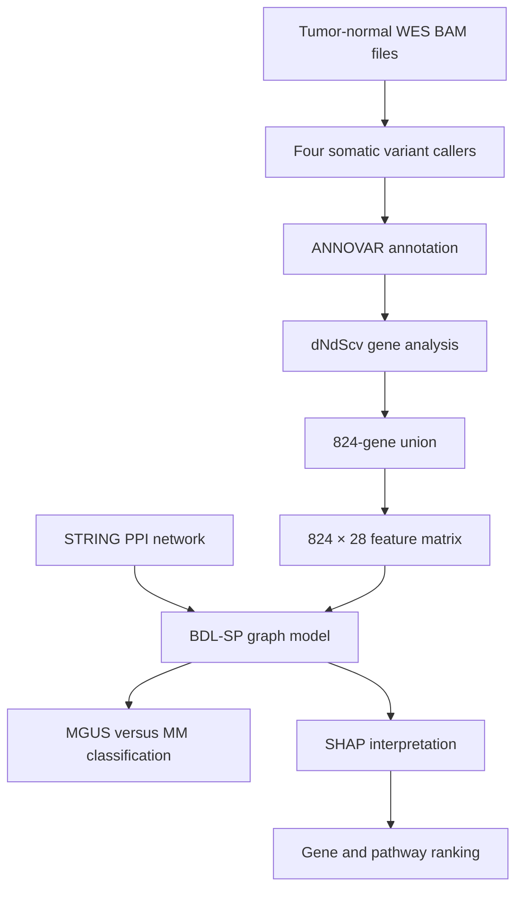

# BDL-SP: Using Bio-Inspired Deep Learning to Identify Altered Signaling Pathways in Multiple Myeloma

Multiple myeloma (MM) is a cancer of plasma cells in the bone marrow. It is usually preceded by **monoclonal gammopathy of undetermined significance (MGUS)**, an asymptomatic precursor condition. Most people with MGUS do not rapidly develop MM, yet the two states share many genomic alterations. This makes it difficult to identify which genes and pathways are associated with malignant transformation.

Our study, **“BDL-SP: A Bio-inspired DL model for the identification of altered Signaling Pathways in Multiple Myeloma using WES data,”** introduces an explainable graph-based deep-learning framework for this problem. The work was published in the *American Journal of Cancer Research* in 2023 ([PubMed](https://pubmed.ncbi.nlm.nih.gov/37168334/); [full text in PubMed Central](https://pmc.ncbi.nlm.nih.gov/articles/PMC10164815/)). The associated code and supplementary results are available in the [BDL-SP GitHub repository](https://github.com/vivekruhela/BDL-SP-Bio-inspired-DL-architecture-for-Identification-of-altered-Signaling-Pathways-in-MM).

BDL-SP stands for **Bio-inspired Deep Learning architecture for the identification of altered Signaling Pathways**. Its central premise is that genes do not act independently. They participate in protein-interaction networks and signaling pathways. BDL-SP therefore combines patient-specific genomic measurements with a protein–protein interaction (PPI) graph, then uses post-hoc explainability to connect model predictions back to genes, genomic features, and biological pathways.


*Figure 1. Overview of the BDL-SP architecture and analysis workflow. Source: [BDL-SP repository](https://github.com/vivekruhela/BDL-SP-Bio-inspired-DL-architecture-for-Identification-of-altered-Signaling-Pathways-in-MM/blob/main/figures/bdl-sp-architecture_v6.jpg).*

> **In one sentence:** BDL-SP learns from the genomic profiles and known interactions of 824 altered genes, distinguishes MGUS from MM, and uses SHAP and pathway enrichment to explain which molecular signals contributed to the distinction.

---

## Why study the transition from MGUS to MM?

MM develops through the accumulation and selection of genomic abnormalities. Some events may already exist during MGUS, whereas others emerge or become more important during progression. Studying these differences can help answer several biological questions:

1. Which genes are significantly altered in MGUS, MM, or both?
2. Which genomic feature types contribute most strongly to separating the two stages?
3. Do interacting groups of genes provide more information than isolated mutations?
4. Which pathways gain or lose statistical significance as disease advances?
5. Can an AI model be interpreted at both the cohort and individual-sample levels?

These questions are difficult because MGUS and MM are heterogeneous, the available cohorts are highly imbalanced, and most samples are cross-sectional rather than paired longitudinal specimens from the same people.

BDL-SP was designed as a **biomarker- and pathway-discovery framework**. It is not an approved clinical diagnostic and does not, by itself, predict whether an individual with MGUS will progress to MM.

---

## The study data

The paper analyzed tumor–normal matched whole-exome sequencing (WES) data from three geographic cohorts:

| Data source | Population represented | Samples used |
|---|---|---:|
| MMRF CoMMpass | American | 1,092 MM |
| European Genome-phenome Archive | European | 33 MGUS |
| AIIMS, New Delhi | Indian | 82 MM and 28 MGUS |
| **Total** | Three geographic cohorts | **1,174 MM and 61 MGUS** |

This combined design increased cohort size and population coverage, but the MM and MGUS classes remained strongly imbalanced. It also means that disease stage, study source, sequencing workflow, and population background may be partly entangled and must be considered when interpreting the results.

---

## From WES reads to an explainable graph model

The workflow begins with BAM files and proceeds through variant calling, annotation, gene selection, feature construction, graph learning, and interpretation.



### Step 1: Variant calling with four tools

The study used four somatic-variant callers:

- MuSE,
- Mutect2,
- SomaticSniper, and
- VarScan2.

Using several callers can improve sensitivity to variants detected under different statistical assumptions. However, caller outputs are not interchangeable; reproducible use requires explicit filtering, quality thresholds, genome build, and normalization rules.

### Step 2: Functional annotation

Variants were annotated with **ANNOVAR** to connect sequence-level changes with genes and functional categories.

### Step 3: Identification of significantly altered genes

The workflow used **dNdScv** to identify genes showing evidence of selection. It found:

- 362 significantly altered genes in MGUS,
- 617 significantly altered genes in MM, and
- 155 genes shared by both stages.

Taking the union produced **824 genes** for model construction. The union strategy was intended to retain stage-specific signals rather than restricting the model to genes common to both conditions.

### Step 4: Construction of 28 genomic features

For each of the 824 genes, the workflow generated 28 genomic features. They summarize three broad SNV groups:

- non-synonymous SNVs,
- synonymous SNVs, and
- other SNVs, including variants outside those two coding categories.

The feature set includes mutation counts and distribution summaries involving measures such as variant allele fraction (VAF) and allele depth (AD). Each patient is therefore represented by a matrix with **824 gene rows and 28 genomic-feature columns**.

### Step 5: Addition of biological structure

The 824 genes were connected using protein-interaction information from **STRING**. This produces an adjacency matrix describing which gene products are connected in the prior interaction network.

---

## BDL-SP for beginners: a city-map analogy

Imagine that each gene is a location in a city.

- A gene’s genomic measurements describe what is happening at that location.
- The STRING network supplies the roads connecting locations.
- Graph convolution allows information to move along those roads.
- The classifier learns whether the city-wide pattern looks more like MGUS or MM.
- SHAP then asks which locations and measurements most influenced the decision.

A conventional tabular model can learn from the measurements, but it does not naturally encode the road map. BDL-SP explicitly uses that biological network to allow the representation of one gene to depend on information from its neighbors.

This does not mean that every STRING edge is active in a plasma cell or in every patient. The graph is prior biological knowledge—a useful scaffold that remains incomplete and context dependent.

---

## BDL-SP for advanced readers

The released implementation uses a normalized STRING-derived adjacency matrix with self-loops. For every patient, the graph model processes the 824-by-28 feature matrix through two graph-convolution stages.

The repository code documents the following configuration:

| Component | Released configuration |
|---|---|
| Input | 824 genes × 28 genomic features |
| PPI graph | STRING-derived adjacency matrix |
| Graph layers | Two graph-convolution layers |
| Hidden dimensions | 28 → 7 → 1 per gene |
| Activation | Leaky ReLU |
| Dropout | 0.75 |
| Output | Two classes: MM and MGUS |
| Loss | Cost-sensitive cross-entropy |
| Class weights in code | 1:20 |
| Regularization | L1 penalty plus dropout |
| Optimizer | Adam |
| Evaluation | Stratified five-fold cross-validation |
| Explainability | SHAP at group and sample levels |

At a high level, each graph-convolution stage performs three operations:

1. normalize the interaction graph and add self-connections;
2. aggregate each gene’s features with information from neighboring genes; and
3. apply a learned transformation and nonlinear activation.

After the second graph layer, each gene has a one-dimensional learned representation. The 824 gene values are flattened and passed to a final layer that produces MM/MGUS probabilities.

### Why cost-sensitive learning?

The dataset contains 1,174 MM samples but only 61 MGUS samples. A naïve classifier could obtain high ordinary accuracy by predicting the majority class. BDL-SP therefore assigns greater loss to errors involving the minority class. The repository code uses a 1:20 class-weight ratio, close to the observed imbalance.

This makes **balanced accuracy**, area under the ROC curve, and area under the precision–recall curve more informative than ordinary accuracy alone.

### Why five-fold evaluation?

In stratified five-fold cross-validation, each fold retains approximately the same class proportions. Every sample is used for testing once and training in the other folds. This provides a more stable estimate than a single split, although external validation on a separately collected cohort remains stronger evidence of generalization.

---

## Model performance

The paper compared BDL-SP with six cost-sensitive machine-learning models, including Random Forest, CatBoost, XGBoost, logistic regression, support vector classification, and decision trees.

The three strongest reported models were:

| Model | Balanced accuracy | AUC |
|---|---:|---:|
| **BDL-SP** | **96.26%** | **0.99** |
| Cost-sensitive Random Forest | 95.5% | 0.99 |
| Cost-sensitive CatBoost | 91.3% | 0.99 |

The important lesson is not that a deep model automatically dominates conventional ML. Random Forest achieved similar predictive performance. The paper argues that BDL-SP’s additional value emerged in its **application-specific interpretation**: the graph architecture and SHAP analysis recovered more previously reported MM-relevant genes among the leading ranks.

Performance estimates should still be read in the context of the small MGUS group, five-fold reuse of one combined dataset, and potential cohort effects.

---

## From classification to explanation with SHAP

BDL-SP used SHAP to rank both genes and genomic feature types according to their contribution to model predictions.

### Group-level interpretation

At the group level, the analysis ranked all 824 genes across MM and MGUS. The paper reports **KIR3DL2, IGLL5, and FCGR2A** as the three highest-ranked genes by the study’s best-SHAP-score procedure.

Other leading genes included previously reported MM-associated drivers and biomarkers such as:

- HLA-A,
- KRAS,
- LTB,
- TP53,
- EGR1,
- FGFR3,
- NFKBIA,
- IRF1, and
- NRAS.

The ranked lists also contained oncogenes such as CARD11, NOTCH1, VAV1, IRS1, MGAM, and ABL2; tumor-suppressor genes such as HLA-B, HLA-C, and SDHA; and actionable-gene candidates including KRAS, NOTCH1, TP53, FGFR3, and ARID1B.

Among 31 previously reported oncogenes present in the 824-gene space, BDL-SP placed:

- 20 in its top 250 genes, and
- 27 in its top 500 genes.

These recovery counts support biological relevance, but they are not independent validation when prior databases are also used to assess the resulting ranking.

### Sample-level interpretation

The analysis also generated gene rankings for individual samples. For each patient, SHAP was applied to fold models that correctly predicted the sample, and the contribution with the largest absolute value was used as the “best SHAP score.”

This helps answer a different question from group-level analysis: not “Which genes matter on average?” but “Which genomic attributes most influenced this particular prediction?”

Sample-level explanations are useful for studying heterogeneity, but they can be unstable across model seeds, correlated inputs, and background datasets. Stability analysis is therefore essential before interpreting a rank as patient-specific biology.

### Ranking the 28 genomic features

The top three genomic features reported by the paper were:

1. total number of SNVs,
2. total number of SNVs in the “Other SNV” group, and
3. standard deviation of VAF among variants in the “Other SNV” group.

The finding that synonymous and non-canonical SNV summaries contributed to classification is biologically interesting because it moves attention beyond protein-changing mutations alone. It does not establish that synonymous variants are causal; these signals may reflect regulatory effects, mutation processes, linkage, sequencing properties, or broader genomic instability.

---

## Connecting genes to altered signaling pathways

The top 500 BDL-SP-ranked genes were subjected to enrichment analysis using KEGG and Reactome. The study organized pathways into four disease-stage patterns:

| Category | Interpretation |
|---|---|
| 1 | Significant in both stages but more significant in MM |
| 2 | Significant in both stages but less significant in MM |
| 3 | Significant only in MM |
| 4 | Significant only in MGUS |

This is more informative than a single list of enriched pathways because it asks how pathway-level evidence changes between precursor and malignant states.

The paper reported:

- 5 KEGG and 9 Reactome pathways that gained significance from MGUS to MM;
- 108 KEGG pathways observed as significantly altered only in MM; and
- 134 Reactome pathways observed as significantly altered only in MM.

Some pathways that lost significance during progression were associated with other disease types, whereas many pathways unique to or strengthened in MM reflected cancer-related processes.

Pathway enrichment remains a statistical summary. Results depend on the selected gene set, gene universe, database release, overlapping pathway definitions, and multiple-testing correction. “Significant pathway” should not be interpreted as proof that every pathway component is functionally active in every patient.

---

## Population-related observations

The study compared the number of known oncogenes, tumor-suppressor genes, oncogene/driver genes, and actionable genes across disease stages and geographic cohorts.

It reported significant differences for several gene groups between MM and MGUS in the combined analysis. Differences were also observed between the Indian and European MGUS cohorts, while the compared Indian and American MM cohorts did not show significant differences across all four groups.

These results motivate ancestry-aware follow-up, but “population effect” cannot be separated cleanly from cohort source, sample handling, sequencing protocol, and disease-stage composition in this study design. Future analyses should include genetic ancestry estimates and harmonized processing rather than using study geography as a proxy for ancestry.

---

## Why BDL-SP is significant

### 1. It combines genomic features with biological networks

The model does not treat genes as unrelated columns. It uses a PPI graph to structure information flow and represent pathway-level relationships.

### 2. It addresses severe class imbalance explicitly

Cost-sensitive learning and balanced metrics reduce the risk of mistaking majority-class prediction for useful MGUS/MM discrimination.

### 3. It connects prediction with biological interpretation

SHAP is applied to genes and genomic feature types at group and sample levels, then gene rankings are linked to known cancer-gene categories and pathway enrichment.

### 4. It studies pathways as changing disease-stage signals

The four-category pathway framework distinguishes pathways that gain significance, lose significance, or appear stage-specific.

### 5. It provides a bridge to later network models

BDL-SP established a static STRING-based GCN and explainability workflow. The later BIO-DGI study extended the broader research direction using attention-based edge weighting and multiple PPI resources to derive a focused 295-gene panel.

---

## Potential research applications

BDL-SP can support several research directions:

1. **Candidate-biomarker discovery**  
   Prioritize genes for functional experiments or independent cohort validation.

2. **Pathway-level comparison of MGUS and MM**  
   Investigate biological processes that become stronger, weaker, or stage specific.

3. **Patient-heterogeneity analysis**  
   Compare sample-level SHAP profiles and assess whether recurrent explanatory patterns define molecular subgroups.

4. **Longitudinal progression studies**  
   Apply a locked model to serial MGUS, smoldering-MM, and MM specimens.

5. **Population-aware genomics**  
   Test whether gene and pathway rankings replicate across ancestries under harmonized sequencing and preprocessing.

6. **Functional prioritization**  
   Select influential genes and network neighborhoods for CRISPR, cell-line, organoid, or animal-model experiments.

7. **Alternative network experiments**  
   Compare STRING with tissue-specific, pathway-specific, or experimentally measured interaction graphs.

8. **Method transfer**  
   Adapt the gene-feature-plus-network design to other precursor-to-malignancy transitions.

---

## BDL-SP compared with related approaches

| Approach | Biological structure | Main strength | Main limitation |
|---|---|---|---|
| Logistic regression / SVM | None unless engineered | Transparent baseline | Limited nonlinear interaction modeling |
| Random Forest / CatBoost | Implicit feature interactions | Strong tabular performance | No explicit gene-network message passing |
| BDL-SP | Static STRING PPI graph | Graph-aware prediction plus SHAP and pathway analysis | Relies on one context-independent network |
| BIO-DGI | Attention-weighted graph from nine PPI resources | Learns relative interaction importance and supports panel construction | More complex and still dependent on prior-network quality |

The paper’s benchmarking shows why both quantitative and qualitative assessment matter. Similar AUC values do not imply that models learn equally useful biological representations.

---

## What the study does not yet establish

A careful interpretation should retain the following limitations:

- The comparison is cross-sectional and largely unpaired; it does not reconstruct progression within individual patients.
- The MGUS class contains only 61 samples, creating substantial uncertainty despite cost-sensitive training.
- Cohort source, geography, sequencing workflow, and disease label may be confounded.
- WES does not capture the full non-coding genome and has limited sensitivity for some structural alterations.
- Combining four variant callers improves coverage but can propagate caller-specific artifacts without strict consensus and filtering rules.
- STRING is not plasma-cell-specific and includes interactions that may be inactive in the relevant disease context.
- SHAP explains the fitted model, not causal disease mechanisms.
- Pathway enrichment is sensitive to gene-set choice and annotation-database version.
- Cross-validation within the combined dataset is not equivalent to independent external validation.
- The work does not establish prospective clinical utility, diagnostic performance, or treatment benefit.

BDL-SP should therefore be presented as an **explainable research framework for genomic biomarker and pathway discovery**, not as a clinical prediction system.

---

## Exploring the BDL-SP repository

The [public repository](https://github.com/vivekruhela/BDL-SP-Bio-inspired-DL-architecture-for-Identification-of-altered-Signaling-Pathways-in-MM) contains the model script, SHAP notebooks, supplementary results, figure, dependency list, and an Apache-2.0 license.

| Repository area | Purpose |
|---|---|
| `src/bdl-sp-top-feature-extraction.py` | GCN training, five-fold evaluation, and model-output generation |
| `src/Notebooks/BDL_SP_SHAP_Analysis.ipynb` | Group-level SHAP analysis |
| `src/Notebooks/samplewise_shap_analysis.ipynb` | Sample-level SHAP analysis |
| `src/Notebooks/shap_individual_feature_plot.ipynb` | Individual-feature visualization |
| `BDL-SP Model results/` | Significant genes, pathways, SHAP rankings, diagrams, and pseudocode supplements |
| `figures/bdl-sp-architecture_v6.jpg` | Graphical workflow and model architecture |
| `requirements.txt` | Partial dependency list |
| `.github/workflows/python-package.yml` | Basic install, lint, and pytest workflow |

### Reproducibility notes

The repository is a research snapshot rather than a turnkey package. Before running it, users should note that:

- the main script contains developer-specific absolute filesystem paths;
- controlled-access cohort data and derived patient feature matrices are not included;
- the code references a STRING adjacency CSV that is not evident in the top-level release;
- dependency versions are unpinned;
- the dependency file includes Python standard-library modules and does not list every imported scientific package, including PyTorch Geometric;
- no end-to-end synthetic example or expected-output test is provided; and
- the README reports testing on Ubuntu 18.04 with 8 GB RAM, which does not define a modern reproducible environment.

A future release would benefit from a versioned Conda or container environment, configurable paths, a small synthetic dataset, a documented adjacency builder, explicit fold files, saved checkpoints, unit tests, and a single command that reproduces a smoke-test result.

---

## Reproducibility checklist for advanced users

Record and freeze the following before attempting to reproduce or extend the study:

- reference genome and ANNOVAR database versions;
- exact versions and parameters for all four variant callers;
- variant normalization, filtering, and union rules;
- dNdScv version, covariates, and significance threshold;
- definitions of all 28 genomic features;
- handling of missing genes and zero-variant samples;
- STRING version, confidence threshold, and identifier mapping;
- the exact ordered list of 824 genes;
- feature-scaling procedure;
- patient-level fold assignments and random seeds;
- class weights and the rationale for their selection;
- optimizer, learning rate, dropout, epoch limit, and early-stopping behavior;
- saved model state used for every SHAP analysis;
- SHAP explainer type, background data, and ranking rule;
- gene-set databases, release dates, gene universe, and correction method; and
- external-validation cohorts and predefined endpoints.

---

## Recommended next steps

1. Validate BDL-SP on an independent, prospectively assembled MGUS/MM cohort.
2. Include smoldering multiple myeloma as an intermediate disease state.
3. Use longitudinal samples to evaluate within-patient molecular evolution.
4. Separate genetic ancestry from geography and study source.
5. Compare static STRING edges with tissue- and plasma-cell-specific interaction networks.
6. Quantify stability of SHAP gene rankings across folds, seeds, and explainers.
7. Benchmark against simple burden-based and clinical baselines using identical splits.
8. Evaluate whether genomic explanations add value beyond established laboratory and cytogenetic markers.
9. Perform multivariable survival or progression analyses in independent cohorts.
10. Functionally validate leading genes and pathway communities.

---

## Take-home message

BDL-SP demonstrates how prior biological knowledge can be incorporated into deep learning without abandoning interpretability. Starting from WES data, the workflow integrates four variant callers, dNdScv gene selection, 28 genomic features, and a STRING-derived network to model 824 genes across MGUS and MM.

The model achieved a reported balanced accuracy of 96.26% and an AUC of 0.99, while its strongest contribution was the post-hoc biological analysis: recovery of known MM-relevant genes, sample-level explanations, genomic-feature ranking, and classification of pathways according to how their significance changes across disease stages.

The next step is not simply a larger model. It is stronger validation—harmonized external cohorts, longitudinal sampling, ancestry-aware analysis, functional experiments, and reproducible software. Within those boundaries, BDL-SP provides a useful framework for moving from mutation lists toward interpretable gene networks and altered signaling pathways.

---

## Resources and citation

- Ruhela V, Jena L, Kaur G, Gupta R, Gupta A. **BDL-SP: A Bio-inspired DL model for the identification of altered Signaling Pathways in Multiple Myeloma using WES data.** *American Journal of Cancer Research*. 2023;13(4):1155–1187. [PubMed](https://pubmed.ncbi.nlm.nih.gov/37168334/) · [PubMed Central](https://pmc.ncbi.nlm.nih.gov/articles/PMC10164815/)
- [BDL-SP source code and supplementary results](https://github.com/vivekruhela/BDL-SP-Bio-inspired-DL-architecture-for-Identification-of-altered-Signaling-Pathways-in-MM)
- [BDL-SP architecture figure](https://github.com/vivekruhela/BDL-SP-Bio-inspired-DL-architecture-for-Identification-of-altered-Signaling-Pathways-in-MM/blob/main/figures/bdl-sp-architecture_v6.jpg)

### Suggested repository citation

```text
Ruhela V, Jena L, Kaur G, Gupta R, Gupta A. BDL-SP: Bio-inspired deep-learning
architecture for identifying altered signaling pathways in multiple myeloma.
https://github.com/vivekruhela/BDL-SP-Bio-inspired-DL-architecture-for-Identification-of-altered-Signaling-Pathways-in-MM
```

> **Medical disclaimer:** This article discusses a research study and research software. It does not provide medical advice, and BDL-SP should not be used for clinical decision-making without appropriate analytical, external, prospective, and regulatory validation.
